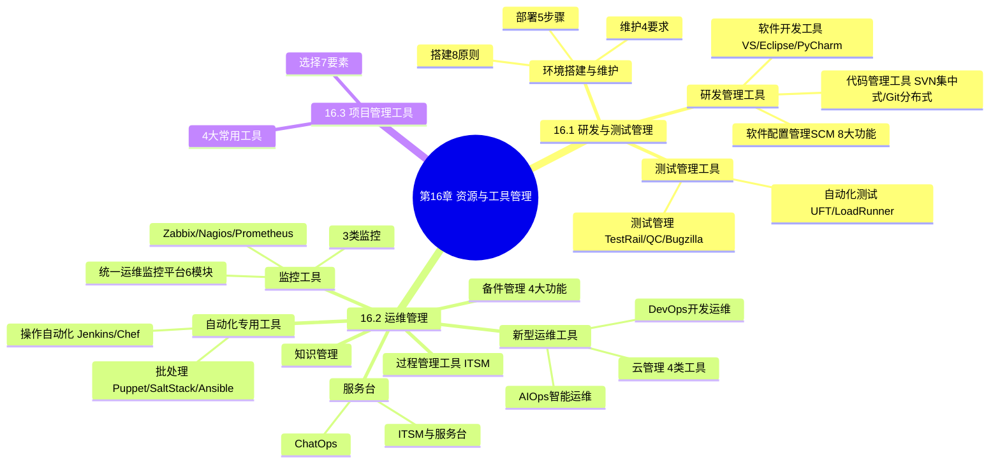

# 第16章 资源与工具管理

> 资源与工具管理是信息系统建设与运维服务的支撑能力，涵盖研发与测试管理、运维管理、项目管理工具三大领域，通过工具化、自动化、智能化手段提升IT服务效率与质量。

---

## 本章知识地图

---

## 16.1 研发与测试管理

### 研发测试环境定义

**研发测试环境**：在基本硬件和宿主软件基础上，为支持系统软件和应用软件的工程化开发和维护而使用的一组软件。由**软件工具**和**环境集成机制**构成。

- 软件工具：支持软件开发的相关过程、活动和任务
- 环境集成机制：为工具集成和软件的开发、测试、维护及管理提供统一支持

**核心关系**：研发测试环境的质量直接影响研发人员的工作效率和质量。

---

### 16.1.1 研发管理工具

研发管理借助信息平台对研发过程中的团队建设、流程设计、绩效管理、风险管理、成本管理、项目管理和知识管理等进行协调活动。

#### 一、软件开发工具

软件开发工具用于辅助软件的开发、运行、维护、管理和支持等活动，目的是**降低开发维护成本、提高生产效率、改进产品质量**。

两个层次：
1. **孤立的单个工具** — 支持某一项特定活动，彼此独立
2. **集成化CASE环境** — 对不同阶段工具集成，有一致用户界面和共享信息数据库

| 工具 | 厂商 | 核心特点 |
|------|------|----------|
| Visual Studio | 微软 | 全面开发工具集，支持C++/C#/VB.NET/F#/Python/JS等，VSTS支持敏捷计划/测试管理/CI/CD |
| Eclipse | IBM捐赠开源 | 基于Java的可扩展IDE，插件化架构（PDE），跨平台，支持CVS/SVN/Git |
| PyCharm | JetBrains | Python IDE，智能代码编辑器/代码审查/调试器/单元测试/版本控制/远程开发/数据库工具 |

**速记口诀：微蚀派（VS-Eclipse-PyCharm），开发工具三层级**

#### 二、代码管理工具

代码管理工具用于存储、追踪代码和目录及其修改历史，可标识不同阶段代码、差异分析、修改撤销、回退版本。

| 类型 | 架构模式 | 代表工具 | 核心特点 |
|------|----------|----------|----------|
| 集中式版本控制 | 客户端/服务器（C/S） | SVN | 中央仓库统一管理，提交需网络连接和授权，管理方便逻辑明确 |
| 分布式版本控制 | 本地仓库+远程仓库 | Git | 每个开发者拥有完整代码库，离线可操作，分支创建合并简单安全，只关心文件整体变化 |

**SVN特点**：
- 每个版本库有唯一URL
- 提交必须有网络连接（非本地版本库）
- 提交需要授权
- 多人先后提交同一部分代码，后提交者需解决冲突

**Git优势**：
- 服务端和客户端都有完整版本库
- 脱离服务端仍可管理版本（查看历史/版本比较）
- 分支创建和合并简单安全
- 大多数操作只访问本地文件，处理速度快

**速记口诀：集中SVN中央仓，分布Git全库离线强**

#### 三、软件配置管理工具（SCM）

软件配置管理（SCM）为软件开发提供管理办法和活动原则，是贯穿软件开发始终的重要质量保证活动。

常见工具：Harvest、ClearCase、StarTeam、Firefly

**SCM八大功能**：

| 序号 | 功能 | 核心内容 |
|------|------|----------|
| 1 | 项目管理 | 建立配置管理计划、创建配置库，确定纳入配置管理的资产和配置项 |
| 2 | 版本管理和基线控制 | 记录修改轨迹，跟踪修改信息，以基线渐进方式完成开发，支持差异比较和版本恢复 |
| 3 | 增强的版本控制 | 快照（多个文件当前版本集合）和分支，支持批量签入/签出/加标签 |
| 4 | 流程控制和变更管理 | 问题跟踪和变更请求管理，跟踪记录生命周期各阶段问题和变更 |
| 5 | 资源维护 | 沙箱技术提供独立工作空间，支持并行开发，修改满意后合并到开发主线 |
| 6 | 过程自动化 | 事件触发机制，一个事件触发另一个事件，规范开发过程 |
| 7 | 管理项目整个生命周期 | 预提供典型开发模式模板，支持自定义生命周期模式 |
| 8 | 与主流开发环境集成 | 版本控制功能与IDE集成，IDE充当沙箱角色 |

**速记口诀：项版增流源自生集（项目/版本/增强/流程/资源/自动化/生命周期/集成）**

---

### 16.1.2 测试管理工具

软件测试工具分为**自动化软件测试工具**和**测试管理工具**。

#### 一、自动化软件测试工具

自动化测试包括4个阶段：自动化测试计划→设计→实施→执行。

按测试技术分类：白盒测试工具、黑盒测试工具、性能测试工具。

| 工具 | 类型 | 厂商 | 核心功能 |
|------|------|------|----------|
| UFT（原QTP） | 功能测试 | HP | GUI测试录制回放、API测试、数据驱动测试、关键字驱动测试、VBScript脚本 |
| LoadRunner | 性能测试 | — | 三大组件：Virtual User Generator（虚拟用户脚本）、Controller（控制器）、Analysis（分析） |

**LoadRunner性能测试流程**：计划测试→创建脚本→定义场景→运行场景→分析结果

**LoadRunner主要特性**：负载生成（模拟数千并发用户）、协议支持（HTTP/HTTPS/FTP/TCP/IP）、脚本录制编辑、性能监控分析、集成监控、报告分析

**速记口诀：UFT功能录回放，LR性能三组件（虚拟用户/控制器/分析）**

#### 二、测试管理工具

测试管理工具核心是**测试用例库**和**缺陷库**。

七大功能：测试计划管理、测试用例管理、测试任务执行、缺陷记录跟踪、报告和分析、团队协作、集成其他工具。

| 工具 | 核心特点 |
|------|----------|
| TestRail | 基于Web的测试用例管理，普通/基线/多套件三种管理方式，支持集成JIRA/GitHub/YouTrack等缺陷追踪工具 |
| Quality Center | 基于Web，4部分：明确需求→测试计划→执行测试→跟踪缺陷，统一平台控制测试流程 |
| Bugzilla | 开源缺陷跟踪系统，缺陷报告/查询过滤/状态管理/统计报告/用户权限/自定义字段/邮件通知/插件扩展 |

**速记口诀：测质缺（TestRail用例/QC全流程/Bugzilla缺陷），用例缺陷双核心**

---

### 16.1.3 研发与测试环境搭建和维护

#### 环境搭建八大原则

| 序号 | 原则 | 说明 |
|------|------|------|
| 1 | 可重现性 | 方便复现问题并调试 |
| 2 | 可协作性 | 多人协作开发，避免冲突 |
| 3 | 与生产环境相似性 | 减少环境带来的问题 |
| 4 | 自动化环境管理 | 使用自动化工具管理和配置，提高效率减少人为出错 |
| 5 | 测试覆盖率 | 确保研发结果符合预期 |
| 6 | 灵活性 | 具备灵活性和可扩展性，能尝试新方法/框架/工具 |
| 7 | 环境隔离性 | 避免研发测试人员之间的环境干扰 |
| 8 | 可维护性 | 能够随时更新和维护 |

**速记口诀：重协似自覆灵隔维**

#### 环境部署五步骤

| 步骤 | 内容 |
|------|------|
| 1 | 硬件设备的选取和配置（内存/处理器/硬盘/网络架构/存储/备份） |
| 2 | 操作系统的安装和配置（与生产环境相似的OS和版本） |
| 3 | 应用程序的安装和配置（与生产环境相同的应用程序） |
| 4 | 数据库的安装和配置（与生产环境相同或类似的数据库） |
| 5 | 测试工具和脚本的准备（性能/可靠性/安全性验证） |

**速记口诀：硬操应数测（硬件→操作系统→应用→数据库→测试工具）**

#### 环境维护四要求

| 要求 | 说明 |
|------|------|
| 定期备份数据 | 确保数据安全性和完整性，通常建议每天备份 |
| 定期更新软件和补丁 | 与生产环境保持一致，避免安全漏洞，注意备份数据 |
| 定期清理数据和日志 | 释放磁盘空间，提高稳定性和性能 |
| 监控环境状态 | 监控硬件/软件/网络，及时发现解决问题，使用监控工具实时监控和报警 |

**速记口诀：备更清监（备份/更新/清理/监控）**

---

## 16.2 运维管理

运维工具包括监控工具、过程管理工具及专用工具，可显著提高运维的可视性、过程组织的有效性以及操作的便利性和安全性。

---

### 16.2.1 监控工具

#### 监控工具三大分类

| 分类 | 监控内容 |
|------|----------|
| IT基础设施监控 | 主机、网络、存储、应用、机房动力环境 |
| 性能监控 | 业务性能监控、应用性能监控、网络性能监控 |
| 业务运营监控 | 业务运营管理、业务流程监控、业务容量监控 |

**速记口诀：基性业（基础设施/性能/业务运营）**

#### 常见监控工具

| 工具 | 核心特点 |
|------|----------|
| Zabbix | 组织级开源分布式监控，Web界面，可监控数千台服务器/虚拟机/应用/数据库/网站/云，支持采集百万级监控指标，跨平台（Linux/Solaris/HP-UX/AIX等） |
| Nagios | 开源监控，服务器代理架构，两个版本：Nagios Core（免费开源，侧重可用性，基于文件配置）和Nagios XI（付费扩展版），支持丰富插件 |
| Prometheus | 开源监控报警框架，**拉（Pull）模型**架构（非传统推Push模型），支持时序数据存储，适用于微服务及云环境监控，服务端自动发现监控对象 |

**Prometheus vs 传统监控**：
- 传统：推（Push）模型，客户端负责在服务端注册及推送
- Prometheus：拉（Pull）模型，服务端决定数据拉取，支持服务发现和横向扩展，适用于微服务架构
- 时序数据：所有指标以时间序列形式存储，每个时间序列由值、时间戳和标签表组成

**速记口诀：Z-N-P三大监控，Zabbix分布广，Nagios代理查，Prom拉模型时序强**

#### 统一运维监控平台

单一监控工具无法满足复杂需求，需将网络/硬件/软件/数据库等纳入统一平台，实现统一采集、统一监控、统一告警、统一展示。

**六大模块**：

| 模块 | 核心功能 |
|------|----------|
| 数据采集 | 集中管理监控对象，统一配置监控策略，集中下发采集任务 |
| 数据检测 | 支持多种异常检测算法，异常防抖、无数据异常检测、异常恢复检测 |
| 告警管理 | 全面及时发现问题，提前预防故障，多种告警通知途径 |
| 故障管理 | 监控信息统一分析，迅速感知异常 |
| 视图管理 | 全局总览视图、应用视角视图、拓扑视图，分角色管理员视图 |
| 监控管理 | 全局的事件中心，统一查询和展示 |

**两种建设方式**：
1. 基于开源监控软件自主开发 — 集成封装和二次开发
2. 定制商业化运维监控平台 — 如嘉为蓝鲸、锐捷网络、华胜天成、联想等

**速记口诀：采检告故视监（采集/检测/告警/故障/视图/监控）**

---

### 16.2.2 过程管理工具

过程管理工具根据合同约定的SLA，对运维服务交付过程或IT服务全过程进行管理，实现IT服务的**可视、可管、可控、可衡量**。

**ITSM（IT服务管理）**：面向过程、以客户为中心的管理方法和规范，核心流程包括服务请求管理、事件管理、问题管理、变更管理。

| 工具 | 核心特点 |
|------|----------|
| Jira Service Management | Atlassian团队，支持模板创建服务台、定制请求表单，整合多渠道请求，AI自助服务和虚拟支持 |
| ServiceHot ITSM | 可视化管理，内置IT服务全部流程开箱即用，拖拽流程设计，已完成国产化适配（龙芯/飞腾/鲲鹏等芯片，中标麒麟/银河麒麟等OS，高斯/达梦/人大金仓等数据库） |

**速记口诀：请事问变（服务请求/事件/问题/变更），可视可管可控可衡量**

---

### 16.2.3 自动化专用工具

#### 一、作业调度/批处理工具

用于实现常规化、标准化作业的统一管理，降低作业执行错误风险。

| 工具 | 架构 | 核心特点 |
|------|------|----------|
| Puppet | C/S结构 | 较早的Linux自动化运维工具，跨平台（Linux/Windows/AIX），客户端周期连接服务器下载配置文件，提供Web界面集中管理 |
| SaltStack | C/S模式 | 加入MQ消息同步机制，秒级在数万台服务器操作，RSA Key身份确认+AES加密传输，需等待客户端全部返回 |
| Ansible | 无需客户端 | 基于SSH协议远程管理，只需一台服务器运行，安装使用简单，支持上千个插件和模块，批量配置/部署/运行命令 |

**速记口诀：PSA批处理，Puppet配置同步，SaltStack消息秒级，Ansible无客户端SSH**

#### 二、操作自动化工具

将IT服务中大量重复性工作由手工转为自动化操作。

| 工具 | 核心特点 |
|------|----------|
| Jenkins | 持续集成自动化工具，自动构建/测试/部署，跨平台，灵活插件体系，基于Java开源，兼容各种CI/开发工具 |
| Chef | 新一代自动化IT工具，Ruby编写的DSL定义IT任务流程，支持多平台和云服务，擅长大规模部署，适合云业务开发运维团队 |

**速记口诀：JC操作自动化，Jenkins持续集成，Chef云部署Ruby**

---

### 16.2.4 服务台

服务台（服务支持中心）是IT运维服务中供方与需方沟通交互的重要界面，负责响应和处理需方的问题和需求，是供方与需方之间的**单一连接点**。

演变：分布式/集中式服务台 → 线上线下结合 + ITSM服务门户

#### ITSM与服务台

IT服务台是处理和管理所有事件、问题和请求的**单一联络点**，还负责运营和维护ITSM相关的自助门户网站和知识库（服务门户）。

| 工具 | 核心特点 |
|------|----------|
| ServiceDesk Plus | 可视化拖拽创建工作流，集成网络管理/应用管理/桌面管理/AD管理，集成事件/问题/变更/资产管理/IT项目管理/知识库 |
| ServiceHot | 融入AI智能机器学习，多渠道提交（邮件/电话/Web/微信），统一运维工作调度，支持IT公告/满意度调查/供应商管理 |
| 云智慧服务台 | 即时聊天平台建立沟通渠道，融合即时通信/呼叫中心/自助提单，基于AI和全文检索实现0线服务支持，自动创建工单 |

#### ChatOps

ChatOps利用AI和大数据实现自动化和主动管理，将人与人、人与工具、工具与工具自然衔接，消除信息孤岛。以沟通为中心，通过ChatBot（聊天机器人）将成员和辅助工具连接，以对话方式完成工作。

**速记口诀：单一联络点服务台，ChatOps对话协作消孤岛**

---

### 16.2.5 知识管理

知识库确保知识管理工作规范化，保证知识库信息的准确性、完整性和可用性，促进提高团队技术和管理能力，提升服务质量，减少重复劳动。

| 工具 | 核心特点 |
|------|----------|
| ITSM内置知识库 | 与服务请求/需求/事件/故障/问题/变更/发布/巡检等流程紧密耦合，赋能服务台智能推送解决方案 |
| Confluence | Atlassian团队，企业知识管理与协同软件，富文本编辑+文档模板，丰富插件生态，与Jira Service Management结合，自动化自助知识库 |
| PingCode Wiki | 国内知识库产品，自动化降低管理成本，整合企业微信/飞书/钉钉，支持Confluence/HTML/Markdown数据迁移，支持Markdown语法与GitHub/GitLab集成 |

**速记口诀：内置CP（ITSM内置/Confluence/PingCode Wiki），知识赋能减重复**

---

### 16.2.6 备件管理

备件管理是有效运维的基础，针对硬件也包含软件等虚拟资产，分为实体备件与虚拟备件两种形态。大部分组织备件管理已与ITSM系统结合，集成在IT资产管理模块中。

**四大功能**：

| 功能 | 核心内容 |
|------|----------|
| 库存信息管理 | 各类IT备件库存数量、资产信息、采购信息、供应商及维保信息、电子文档、干系人信息 |
| 备件维保服务生命周期管理 | 技术服务流程、维保服务流程、维修流程、退换货流程、报废流程 |
| 出入库审批流程 | 出入库或调拨流程、流程属性信息、审批环节和审批人员、与其他IT服务管理流程关联 |
| 备件查询与追踪 | 便捷查询和申领入口、备件当前状况及历史信息跟踪查询、可视化报表分析 |

ITSM资产管理模块可对资产整个生命周期全程管理，与服务请求/事件/问题/变更/巡检等流程衔接，支持资产跟踪/配置管理/软件许可管理/软件使用监控/采购与合同管理。

**速记口诀：库维出查（库存/维保/出入库/查询追踪），实体虚拟双形态**

---

### 16.2.7 新型运维工具

#### 一、AIOps（智能运维）

AIOps利用大数据、人工智能或机器学习技术，把运维人员从纷繁复杂的运维事务中解放出来。

分为**智能运维平台**和**智能运维工具**，平台占比较高，基于已有运维数据整合分析，通过算法分析、可视化、智能调度等方式解决自动化运维未能解决的问题，最终实现**运维无人化、智能化**。

| 产品 | 核心特点 |
|------|----------|
| 嘉为蓝鲸 | 基于腾讯蓝鲸PaaS体系，数据治理和数据挖掘平台，支持异常检测/指标预测/关联分析/健康画像/故障根因分析，1个愿景：质量、成本、效率三者兼顾的无人值守运维 |
| 云智慧 | 数据驱动平台架构，从数据采集到智能应用的一体化技术底座，数百个应用场景模板，适配国产主流CPU/OS/数据库/中间件 |

#### 二、DevOps（开发运维）

DevOps来自Development（开发）和Operations（运维）的组合，通过自动化的持续集成、持续部署，实现软件的快速交付和持续改进。

**八大类DevOps工具**：

| 类别 | 代表工具 |
|------|----------|
| 版本控制工具 | Git、Mercurial、SVN |
| 自动化构建工具 | Maven、Gradle |
| 自动化测试工具 | Selenium、JUnit |
| 持续集成/持续交付工具 | Jenkins、Travis CI、GitLab CI/CD |
| 配置管理工具 | Ansible、Chef、Puppet |
| 日志管理工具 | ELK Stack（Elasticsearch、Logstash、Kibana）、Graylog |
| 容器化工具 | Docker、Kubernetes |
| 云平台 | AWS、Microsoft Azure、Google Cloud Platform |

一站式DevOps平台：嘉为蓝鲸、云加速、博云牧繁等。

**速记口诀：版构测持配日容云（版本/构建/测试/CI-CD/配置/日志/容器/云平台）**

#### 三、云管理

多云架构给IT管理增添复杂性，需依赖云管理工具。

| 类型 | 全称 | 核心功能 |
|------|------|----------|
| CloudOS | 虚拟化云工具 | 把硬件资源从物理方式转变为逻辑方式，灵活管理，最大化利用硬件资源 |
| CMP | 云管理工具 | 统一管理公有云/私有云/容器云/虚拟化平台/物理服务器/虚拟机/网络设备/存储设备，包含云资源适配器/资源管理/服务管理/运营管理/门户 |
| CSM | 云安全工具 | 保障云资源及应用和数据安全，包含安全监测/审计/威胁分析/防护/处置 |
| CPS | 云专业服务工具 | 增强服务效率和质量、降低风险，包含云迁移/云测试/云备份等 |

**速记口诀：四C云管（CloudOS虚拟化/CMP管理/CSM安全/CPS专业服务）**

---

## 16.3 项目管理工具

项目管理工具在同一个系统平台上实现从需求分析、项目规划、项目实施、配置管理、测试管理到软件交付的软件全生命周期管理。

### 常用项目管理工具

| 工具 | 核心特点 |
|------|----------|
| PingCode | 覆盖软件研发全生命周期，涵盖项目管理/测试管理/知识管理/效能度量/目标管理，支持Scrum/Kanban/瀑布模型，敏捷开发+Kanban管理+瀑布+产品需求+文档协作+测试管理+效能度量 |
| 禅道 | 国产开源研发项目管理软件，4个核心框架：项目集→产品→项目→执行，3种模型：Scrum敏捷/瀑布/看板，集产品/项目/质量/文档/组织/事务管理于一体 |
| Jira | 全球知名IT项目管理软件，配置灵活/功能全面/部署简单/扩展丰富，事务（最小单元）从创建到完成的路径为工作流（状态和变迁），不足：价格高/配置复杂/中文界面不够友好 |
| Microsoft Project | 微软桌面产品，5个阶段（建议/启动计划/实施/控制/收尾），功能：项目计划/任务管理/资源管理/时程表进度/多种视图（网格/板/甘特图）/报告/路线图/项目协作 |

**禅道四层管理框架**：
1. **项目集**（最高层级）— 互相关联且被协调管理的项目集合，制定战略规划、分配资源
2. **产品**（核心）— 所有工作围绕产品展开，产品经理创建产品、关联项目集、梳理需求
3. **项目** — 项目集下的单个项目，可选敏捷/瀑布/看板模型
4. **执行**（最底层）— 完成项目的一系列动作，核心概念：需求、任务、缺陷、用例，完成一次执行即一期迭代

**速记口诀：禅J-P-M四工具，禅道集产项执四层**

### 项目管理工具的选择

**七大评估要素**：

| 要素 | 说明 |
|------|------|
| 团队规模 | 小团队简单任务列表即可，大团队需复杂工具高效分配/协作/跟踪 |
| 团队的工作方式 | 远程协作/实时协作/移动端访问支持 |
| 业务需求 | 匹配不同业务需求的功能特性和部署环境 |
| 自定义和可扩展性 | 未来增长扩展性，能轻松添加新功能或用户 |
| 易用性 | 用户界面直观明了，易于导航和访问关键功能 |
| 安全性 | 确保敏感信息保护，医疗保健/金融等行业必要 |
| 成本 | 符合团队预算，开源需二次开发，商业软件考虑订阅或一次性购买 |

**速记口诀：规方需扩易安成（规模/方式/需求/扩展/易用/安全/成本）**

---

## 核心记忆口诀汇总

| 章节 | 口诀 | 含义 |
|------|------|------|
| 16.1 研发管理工具 | 微蚀派 | VS/Eclipse/PyCharm三大开发工具 |
| 16.1 代码管理 | 集中SVN中央仓，分布Git全库离线强 | 集中式SVN vs 分布式Git |
| 16.1 SCM八大功能 | 项版增流源自生集 | 项目/版本基线/增强版本/流程控制/资源维护/过程自动化/生命周期/环境集成 |
| 16.1 测试工具 | UFT功能录回放，LR性能三组件 | UFT功能测试/LoadRunner性能测试 |
| 16.1 测试管理 | 测质缺 | TestRail用例/QC全流程/Bugzilla缺陷 |
| 16.1 环境搭建原则 | 重协似自覆灵隔维 | 可重现/可协作/相似性/自动化/覆盖率/灵活性/隔离性/可维护性 |
| 16.1 环境部署 | 硬操应数测 | 硬件→操作系统→应用→数据库→测试工具 |
| 16.1 环境维护 | 备更清监 | 备份/更新/清理/监控 |
| 16.2 监控分类 | 基性业 | IT基础设施/性能/业务运营 |
| 16.2 监控工具 | Z-N-P | Zabbix/Nagios/Prometheus |
| 16.2 统一监控 | 采检告故视监 | 数据采集/检测/告警/故障/视图/监控管理 |
| 16.2 过程管理 | 请事问变 | 服务请求/事件/问题/变更 |
| 16.2 批处理 | PSA | Puppet/SaltStack/Ansible |
| 16.2 操作自动化 | JC | Jenkins/Chef |
| 16.2 备件管理 | 库维出查 | 库存/维保/出入库/查询追踪 |
| 16.2 DevOps工具 | 版构测持配日容云 | 版本/构建/测试/CI-CD/配置/日志/容器/云平台 |
| 16.2 云管理 | 四C云管 | CloudOS/CMP/CSM/CPS |
| 16.3 项目管理 | 禅J-P-M | 禅道/Jira/PingCode/MS Project |
| 16.3 工具选择 | 规方需扩易安成 | 规模/方式/需求/扩展/易用/安全/成本 |

---

> 📁 语音分段MP3：`ch16-语音分段/` | 语音脚本：`ch16-语音复习脚本.txt`
