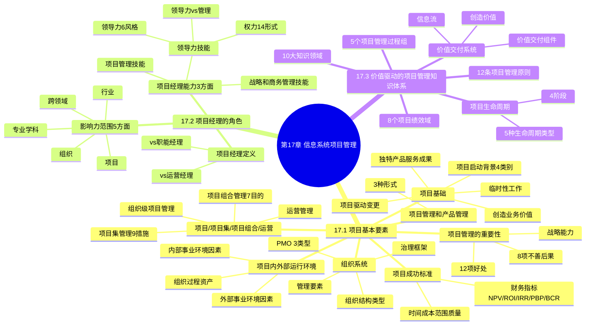

# 第17章 信息系统项目管理

> 信息系统项目管理是系统规划与管理师的核心能力，涵盖项目基本要素、项目经理角色、价值驱动的项目管理知识体系三大领域。本章是综合+案例+论文三科共考核心区。

---

## 本章知识地图

---

## 17.1 项目基本要素

### 17.1.1 项目基础

**项目定义**：项目是为创造独特的产品、服务或成果而进行的临时性工作。

**项目五大特征**：

| 序号 | 特征 | 说明 |
|------|------|------|
| 1 | 独特的产品、服务或成果 | 可交付成果是有形或无形的，每个项目仍具备独特性（需求/设计/运行环境/干系人） |
| 2 | 临时性工作 | 有明确的起点和终点，但不意味着持续时间短。可宣告结束：达成目标/不能达成/资金耗尽/需求不存在/资源不足/法律原因 |
| 3 | 项目驱动变更 | 推动组织从"当前状态"转换到"将来状态"，获得更高业务价值 |
| 4 | 创造业务价值 | 有形效益（货币资产/股东权益/固定资产/市场份额）+ 无形效益（商誉/声誉/商标/品牌认知度） |
| 5 | 项目启动背景 | 4个基本类别促进项目创建 |

**项目启动背景四类别**：

| 类别 | 说明 | 典型因素 |
|------|------|----------|
| 符合法律法规或社会需求 | 应对法规和社会要求 | 法律要求、社会需要、环境需要 |
| 创造、改进或修复产品/过程/服务 | 应对技术/竞争力/材料/问题 | 新技术、竞争力、材料、问题 |
| 执行、变更业务或技术战略 | 应对政策/市场/经济/客户/干系人/战略机会 | 政策变革、市场需求、经济变革、客户要求 |
| 满足干系人要求或需求 | 应对干系人/业务过程改进 | 干系人需求、业务过程改进 |

**速记口诀：独临驱创启（独特/临时/驱动变更/创造价值/启动背景）**

### 17.1.2 项目管理的重要性

**项目管理定义**：将知识、技能、工具与技术应用于项目活动，以满足项目的要求。

**有效项目管理的12项好处**：
1. 达成业务目标 2. 满足干系人期望 3. 提高可预测性 4. 提高成功概率 5. 适当时间交付正确产品 6. 解决问题和争议 7. 及时应对风险 8. 优化组织资源使用 9. 识别/挽救/终止失败项目 10. 管理制约因素（范围/质量/进度/成本/资源） 11. 平衡制约因素影响 12. 更好方式管理变更

**项目管理不善的8项后果**：超过时限/成本超支/质量低劣/返工/范围失控/声誉受损/干系人不满意/无法达成目标

**战略能力**：有效和高效的项目管理是组织的战略能力，能将项目成果与业务目标联系、更有效竞争、实现可持续发展、应对外部环境影响。

### 17.1.3 项目成功的标准

**传统测量指标**：时间、成本、范围、质量 + 项目目标实现情况

**三个关键问题**：①怎样才算项目成功？②如何评估？③哪些因素影响？

**项目成功可能涉及的标准**：
- 完成项目效益管理计划
- 达到财务测量指标：**净现值（NPV）、投资回报率（ROI）、内部报酬率（IRR）、投资回收期（PBP）、效益成本比率（BCR）**
- 达到非财务目标
- 组织从"当前状态"转移到"将来状态"
- 履行合同条款
- 达到组织战略目标
- 使干系人满意
- 可接受的客户采纳度
- 可交付成果整合到运营环境
- 满足交付质量
- 遵循治理规则

**速记口诀：时成范质四指标，净回内收效益比（NPV/ROI/IRR/PBP/BCR）**

### 17.1.4 项目、项目集、项目组合和运营管理之间的关系

**核心概念**：

| 概念 | 定义 | 重点 |
|------|------|------|
| 项目 | 为创造独特产品/服务/成果的临时性工作 | "正确地做事" |
| 项目集 | 一组相互关联且被协调管理的项目/子项目集/项目集活动，获得分别管理无法获得的利益 | 注重组成部分间依赖关系 |
| 项目组合 | 为实现战略目标而组合在一起管理的项目/项目集/子项目组合/运营工作的集合 | "做正确的事" |
| 运营管理 | 关注产品的持续生产、服务的持续提供 | 使用最优资源满足客户要求 |

**三者对比**：

| 比较方面 | 项目 | 项目集 | 项目组合 |
|----------|------|--------|----------|
| 定义 | 临时性工作 | 相互关联且被协调管理的项目集合 | 为实现战略目标组合在一起管理的集合 |
| 范围 | 渐进明细 | 各组件输出和成果协调互补 | 随组织战略目标变化 |
| 变更 | 预期并管理控制 | 必要时接受和适应变更 | 持续监督内外部环境变更 |
| 规划 | 渐进明细转化为详细计划 | 利用高层级计划跟踪依赖关系 | 建立维护必要过程和沟通 |
| 管理 | 项目经理管理项目团队 | 项目集经理协调组件活动 | 项目组合经理管理或协调人员 |
| 监督 | 监控生产产品/服务/成果 | 监督组件进展确保效益实现 | 监督战略变更和总体资源分配 |
| 成果 | 质量/时间/预算/客户满意度 | 交付效益的效率和效果 | 总体投资效果和实现效益 |

**项目集管理9项措施**：
1. 调整组织或战略方向 2. 将项目集范围分配到组成部分 3. 管理组成部分间依赖关系 4. 管理项目集风险 5. 解决制约因素和冲突 6. 解决项目与项目集间问题 7. 同一治理框架内管理变更 8. 分配预算到多个项目 9. 确保实现效益

**项目组合管理7目的**：
1. 指导投资决策 2. 选择最佳组合方式 3. 提供决策透明度 4. 确定资源分配优先级 5. 提高投资回报可能性 6. 集中管理综合风险 7. 确定是否符合组织战略

**组织级项目管理**：为实现战略目标，通过组织驱动因素整合项目组合、项目集和项目管理的框架。

**速记口诀：项目"正确做事"，组合"做正确事"，集9措组7目的**

### 17.1.5 项目内外部运行环境

**组织过程资产5类**：
1. 过程资产（工具/方法论/方法/模板/框架/模式/PMO资源）
2. 治理文件（政策和流程）
3. 数据资产（数据库/文件库/度量指标/数据/工件）
4. 知识资产（隐性知识）
5. 安保和安全（设施访问/数据保护/保密级别/专有秘密）

**内部事业环境因素5类**：组织文化结构和治理/设施和资源物理分布/基础设施/信息技术软件/资源可用性/员工能力

**外部事业环境因素8类**：市场条件/社会和文化影响/监管环境/商业数据库/学术研究/行业标准/财务考虑因素/物理环境因素

**速记口诀：资产5类过治数知安，内部文设基信资员，外部市社监商学行财物**

### 17.1.6 组织系统

组织系统三要素：**治理框架、管理要素、组织结构类型**

**治理框架**：在组织内行使职权的框架，包括规则、政策、程序、规范、关系、系统和过程。

**管理要素**：组织内部关键职能部门或一般管理原则的组成部分（部门/工作职权/工作职责/行动纪律/统一指挥/统一领导/目标优先/合理薪酬/资源优化/沟通渠道等）。

**常见组织结构类型**：

| 类型 | 项目经理角色 | 资源可用性 | 项目管理人员 |
|------|-------------|-----------|-------------|
| 系统型或简单型 | 兼职（协调员） | 极少或无 | 极少或无 |
| 职能（集中式） | 兼职（协调员） | 极少或无 | 兼职 |
| 多部门（职能可复制） | 兼职（协调员） | 极少或无 | 兼职 |
| 矩阵-强 | 全职（指定工作角色） | 中到高 | 全职 |
| 矩阵-弱 | 兼职 | 低 | 兼职 |
| 矩阵-均衡 | 兼职 | 低到中 | 兼职 |
| 项目导向 | 全职（指定工作角色） | 高到几乎全部 | 全职 |
| 虚拟 | 全职或兼职 | 低到中 | 全职或兼职 |
| 混合型 | 混合 | 混合 | 混合 |
| 项目管理办公室 | 全职（指定工作角色） | 高到几乎全部 | 全职 |

**PMO（项目管理办公室）3种类型**：

| 类型 | 控制程度 | 核心特点 |
|------|----------|----------|
| 支持型 | 低 | 担当顾问角色，提供模板/最佳实践/培训/经验教训，项目资源库 |
| 控制型 | 中 | 提供支持+要求服从，要求采用项目管理框架/特定模板/遵从治理框架 |
| 指令型 | 高 | 直接管理和控制项目，项目经理由PMO指定并向其报告 |

**PMO对项目经理的6项支持**：
1. 对共享资源进行管理 2. 识别和制定项目管理方法/最佳实践/标准 3. 指导/辅导/培训/监督 4. 通过项目审计监督合规性 5. 制定和管理项目政策/程序/模板/组织过程资产 6. 对跨项目沟通进行协调

**速记口诀：组织系统治管构，PMO支控指三型，6项支持资方指审文通**

### 17.1.7 项目管理和产品管理

**产品定义**：可量化生产的工件（包括服务及其组件），可以是最终制品或组件制品。

**产品生命周期**：引入→成长→成熟→衰退

**产品管理3种形式**：
1. 产品生命周期中包含项目集管理 — 规模大或长期运作的产品
2. 产品生命周期中包含单个项目管理 — 将产品作为单个项目目标
3. 项目集内的产品管理 — 在项目集范围内应用完整产品生命周期

---

## 17.2 项目经理的角色

### 17.2.1 项目经理的定义

| 角色 | 职责 |
|------|------|
| 职能经理 | 专注于对某个职能领域或业务部门的管理监督 |
| 运营经理 | 负责保证业务运营的高效性 |
| 项目经理 | 由执行组织委派，负责领导团队实现项目目标 |

### 17.2.2 项目经理的影响力范围

**5个影响力范围**：

| 范围 | 核心内容 |
|------|----------|
| 项目 | 领导团队实现目标和干系人期望，平衡制约因素，担任沟通者，使用软技能达成共识 |
| 组织 | 与其他项目经理互动，扮演倡导者角色，提高项目管理能力和技能，展现价值/提高接受度/提高PMO效率 |
| 行业 | 关注行业最新发展趋势（产品技术开发/新兴市场/标准/技术支持工具/经济力量/过程改进） |
| 专业学科 | 持续知识传递和整合（分享知识/参与培训继续教育） |
| 跨领域 | 指导和教育其他专业人员，担任非正式宣传大使 |

**速记口诀：项组行专跨（项目/组织/行业/专业/跨领域）**

### 17.2.3 项目经理的能力

**三大关键技能**：

| 技能 | 说明 |
|------|------|
| 项目管理 | 与项目/项目集/项目组合管理特定领域相关的知识、技能和行为，帮助达成项目目标 |
| 战略和商务 | 关于行业和组织的知识和专业技能，有助于提高绩效并取得更好业务成果 |
| 领导力 | 指导、激励和带领团队所需的知识、技能和行为，帮助组织达成业务目标 |

**领导力技能4个方面**：

1. **人际交往** — 研究人的行为和动机，借助人际关系让项目事项得到落实
2. **领导者品质和技能** — 有远见/积极乐观/乐于合作/管理关系和冲突/多种方式沟通（90%时间花在沟通上）/尊重他人/诚信正直/适时称赞/终身学习/关注重要事情/整体系统角度/批判性思维/创建高效团队
3. **政策和权力** — 权力14种表现形式
4. **领导力与管理** — 领导力不等同于管理

**权力14种表现形式**：

| 序号 | 权力形式 | 说明 |
|------|----------|------|
| 1 | 地位 | 正式/权威/合法，组织或团队授予的正式职位 |
| 2 | 信息 | 对信息收集或分发的控制 |
| 3 | 参考 | 因他人的尊重和赞赏而获得的信任 |
| 4 | 情境 | 在危机等特殊情况下获得的权力 |
| 5 | 个性或魅力 | 魅力、吸引力 |
| 6 | 关系 | 参与人际交往、联系和结盟 |
| 7 | 专家 | 拥有的技能和信息、经验、培训、教育、证书 |
| 8 | 奖励相关 | 能够给予表扬、金钱或其他奖励 |
| 9 | 处罚或强制力 | 给予纪律处分或施加负面后果 |
| 10 | 迎合 | 运用恭维或其他常用手段赢得青睐 |
| 11 | 施加压力 | 限制选择或活动的自由 |
| 12 | 引发愧疚 | 强加的义务或责任感 |
| 13 | 说服力 | 能够提供论据使他人执行 |
| 14 | 回避 | 拒绝参与 |

**速记口诀：地信参情魅关专，奖罚迎压疚说避**

**领导力6种风格**：

| 风格 | 特点 |
|------|------|
| 放任型 | 允许团队自主决策和设定目标（无为而治型） |
| 交易型 | 根据目标、反馈和成就给予奖励 |
| 服务型 | 做出服务承诺，处处先为他人着想，关注他人成长/学习/发展/自主性/福利 |
| 变革型 | 通过理想化特质和行为、鼓舞性激励、促进创新创造、个人关怀提高追随者能力 |
| 魅力型 | 能够激励他人，精神饱满，热情洋溢，充满自信，说服力强 |
| 交互型 | 结合交易型、变革型和魅力型领导的特点 |

**速记口诀：放交服变魅交（放任/交易/服务/变革/魅力/交互）**

**领导力 vs 管理**：

| 管理维度 | 领导力维度 |
|----------|-----------|
| 直接利用职位权力 | 利用关系的力量指导、影响与合作 |
| 维护 | 建设 |
| 管理 | 创新 |
| 关注系统和架构 | 关注人际关系 |
| 依赖控制 | 激发信任 |
| 关注近期目标 | 关注长期愿景 |
| 了解方式和时间 | 了解情况和原因 |
| 关注赢利 | 关注范围 |
| 接受现状 | 挑战现状 |
| 正确地做事 | 做正确的事 |

---

## 17.3 价值驱动的项目管理知识体系

价值驱动的项目管理知识体系包含六大组成部分：**项目管理原则、绩效域、项目生命周期、过程组、十大知识领域、价值交付系统**。

项目管理原则是基础，是所有项目干系人在整个项目生命周期中各项活动的行动指南。

### 17.3.1 项目管理原则（12条）

| 序号 | 原则 | 核心要点 |
|------|------|----------|
| 1 | 勤勉、尊重和关心他人 | 以负责任方式行事，关注内外部职责，诚信/关心/可信/合规 |
| 2 | 营造协作的项目团队环境 | 项目由团队交付，团队共识/组织结构/过程，角色职责：职权/担责/职责 |
| 3 | 促进干系人有效参与 | 干系人影响项目绩效和成果，有效果且有效率的参与和沟通 |
| 4 | 聚焦于价值 | 价值是项目成功最终指标，商业论证包含商业需要/项目理由/商业战略 |
| 5 | 识别、评估和响应系统交互 | 从整体角度识别内外部环境，系统整体性思维 |
| 6 | 展现领导力行为 | 有效的领导力有助项目成功，领导力与职权不同，根据情境调整风格 |
| 7 | 根据环境进行裁剪 | 每个项目具有独特性，裁剪应持续进行，提高创新/效率/生产力 |
| 8 | 将质量融入过程和成果中 | 质量包含绩效/一致性/可靠性/韧性/满意度/统一性/效率/可持续性 |
| 9 | 驾驭复杂性 | 复杂性源于人类行为/系统行为/不确定性模糊性/技术创新 |
| 10 | 优化风险应对 | 持续评估风险（机会和威胁），机会最大化，威胁最小化 |
| 11 | 拥抱适应性和韧性 | 适应性是应对变化的能力，韧性是接受冲击和快速恢复的能力 |
| 12 | 为实现目标而驱动变革 | 采用结构化变革方法，帮助从当前状态过渡到未来状态 |

**速记口诀：勤协干价系领裁，质险适变十二则**

> 注：第2题判断题考点——"勤勉、尊重和关心他人"是原则一，不是"展现领导力行为"（原则六）。

### 17.3.2 项目生命周期和项目阶段

**通用项目生命周期4阶段**：

| 阶段 | 核心内容 | 典型输出 |
|------|----------|----------|
| 启动项目 | 定义新项目或新阶段 | 项目章程 |
| 组织与准备 | 明确范围、优化目标 | 项目管理计划 |
| 执行项目工作 | 完成计划中确定的工作 | 验收的可交付成果 |
| 结束项目 | 正式完成或结束 | 存档的项目文件 |

**生命周期特征**：
- 成本与人力投入：开始时低→执行期间最高→快结束时迅速回落
- 风险与不确定性：开始时最大→逐步降低
- 变更和纠正错误成本：随项目接近完成而显著增高

**速记口诀：启组执结四阶段**

**5种开发生命周期类型**：

| 类型 | 需求确定 | 交付方式 | 变更管理 | 干系人参与 |
|------|----------|----------|----------|-----------|
| 预测型（瀑布型） | 开发前预先确定 | 项目结束一次交付 | 尽量限制变更 | 特定里程碑点参与 |
| 迭代型 | 早期确定 | 通过重复循环活动开发产品 | 定期融入变更 | 定期参与 |
| 增量型 | 渐进增加功能 | 分次交付各子集 | 定期融入变更 | 定期参与 |
| 适应型（敏捷型） | 动态变化 | 频繁交付有价值子集 | 实时融入变更 | 持续参与 |
| 混合型 | 预测型+适应型组合 | — | — | — |

**迭代 vs 增量区别**：迭代是通过一系列重复循环活动来开发产品；增量是渐进地增加产品功能。

**速记口诀：预迭增适混五型**

### 17.3.3 项目管理过程组（5个）

| 过程组 | 核心内容 |
|--------|----------|
| 启动过程组 | 定义新项目或现有项目的新阶段，授权开始 |
| 规划过程组 | 明确项目范围、优化目标，制订行动计划 |
| 执行过程组 | 完成项目管理计划中确定的工作 |
| 监控过程组 | 跟踪、审查和调整项目进展与绩效，识别变更并启动变更 |
| 收尾过程组 | 正式完成或结束项目、阶段或合同 |

**过程组 vs 项目阶段**：
- 过程组：针对项目管理过程的逻辑划分
- 项目阶段：项目从开始到结束所经历的一系列阶段，以可交付成果完成为结束标志

**适应型项目中的过程组特点**：
- 启动：每个迭代期开展，频繁回顾项目章程
- 规划：先制订高层级计划，逐渐细化
- 执行：通过迭代指导和管理，演示和回顾性审查
- 监控：维护未完项清单，工作和变更列入同一张清单
- 收尾：优先级排序，首先完成最具业务价值的工作

**速记口诀：启规执监收五组**

### 17.3.4 项目管理知识领域（10大）

| 序号 | 知识领域 | 核心内容 |
|------|----------|----------|
| 1 | 项目整合管理 | 识别、定义、组合、统一和协调各过程和活动 |
| 2 | 项目范围管理 | 确保项目做且只做所需的全部工作 |
| 3 | 项目进度管理 | 管理项目按时完成所需的各个过程 |
| 4 | 项目成本管理 | 规划、估算、预算、融资、筹资、管理和控制成本 |
| 5 | 项目质量管理 | 把质量政策应用于规划、管理、控制质量和产品 |
| 6 | 项目资源管理 | 识别、获取和管理所需资源 |
| 7 | 项目沟通管理 | 确保项目信息及时恰当地规划、收集、生成、发布、存储、检索、管理、控制、监督和处置 |
| 8 | 项目风险管理 | 规划风险/识别风险/分析风险/规划应对/实施应对/监督风险 |
| 9 | 项目采购管理 | 从项目团队外部采购或获取所需产品/服务/成果 |
| 10 | 项目干系人管理 | 识别/分析/制定策略/调动干系人参与 |

**速记口诀：整范进成质资沟风采干**

### 17.3.5 项目绩效域（8个）

项目绩效域是一组对有效地交付项目成果至关重要的活动，是项目执行过程中需要密切关注的相互作用、相互关联和相互依赖的领域。

| 序号 | 绩效域 | 关注内容 |
|------|--------|----------|
| 1 | 干系人 | 与干系人互动，促使有效参与 |
| 2 | 团队 | 营造协作团队环境，建设和管理团队 |
| 3 | 开发方法和生命周期 | 选择合适开发方法和项目生命周期 |
| 4 | 规划 | 组织、准备和协调项目活动 |
| 5 | 项目工作 | 管理项目资源、物理资源，保持项目聚焦 |
| 6 | 交付 | 满足范围和质量要求，交付成果 |
| 7 | 测量 | 评估绩效，评估可行性 |
| 8 | 不确定性 | 识别、评估和应对风险，驾驭复杂性 |

**8个绩效域共同构成统一整体**，相互依赖，每个绩效域都与其他绩效域相互关联，不能孤立处理。

**速记口诀：干团开规工交测不（干系人/团队/开发方法/规划/项目工作/交付/测量/不确定性）**

### 17.3.6 价值交付系统

价值交付系统描述项目如何在系统内运作，为组织及干系人创造价值。

**三大组成部分**：

1. **创造价值** — 5种方式：创造新产品/服务/成果、积极社会环境贡献、提高效率/生产力/效果/响应能力、推动必要变革、维持已有收益

2. **价值交付组件** — 项目组合、项目集、项目、产品和运营共同组成符合组织战略的价值交付系统

3. **信息流** — 信息和反馈在所有价值交付组件间一致共享：
   - 高层领导→项目组合：战略信息
   - 项目组合→项目集和项目：预期成果/收益/价值
   - 项目集和项目→运营：可交付物及支持维护信息
   - 运营→项目集和项目：调整/修复/更新反馈
   - 项目集和项目→项目组合：绩效信息和进展
   - 项目组合→高层领导：项目组合绩效信息

**价值链条**：可交付物→成果→收益→价值

**速记口诀：创组信三要素，可交成果收益价值链**

---

## 核心记忆口诀汇总

| 章节 | 口诀 | 含义 |
|------|------|------|
| 17.1 项目特征 | 独临驱创启 | 独特/临时/驱动变更/创造价值/启动背景 |
| 17.1 成功标准 | 时成范质四指标 | 时间/成本/范围/质量 |
| 17.1 财务指标 | 净回内收效益比 | NPV/ROI/IRR/PBP/BCR |
| 17.1 三者关系 | 项目"正确做事"，组合"做正确事" | 项目vs项目组合管理重点 |
| 17.1 项目集措施 | 集9措组7目的 | 项目集9项措施/项目组合7目的 |
| 17.1 事业环境 | 资产5类，内5外8 | 组织过程资产5类/内部5类/外部8类 |
| 17.1 组织系统 | 治管构 | 治理框架/管理要素/组织结构 |
| 17.1 PMO | 支控指 | 支持型/控制型/指令型 |
| 17.1 PMO支持 | 资方指审文通 | 6项支持职能 |
| 17.2 影响力范围 | 项组行专跨 | 项目/组织/行业/专业/跨领域 |
| 17.2 项目经理能力 | 项战领 | 项目管理/战略商务/领导力 |
| 17.2 权力形式 | 地信参情魅关专，奖罚迎压疚说避 | 14种权力 |
| 17.2 领导力风格 | 放交服变魅交 | 放任/交易/服务/变革/魅力/交互 |
| 17.3 12条原则 | 勤协干价系领裁，质险适变十二则 | 12条项目管理原则 |
| 17.3 生命周期 | 启组执结 | 启动/组织与准备/执行/结束 |
| 17.3 生命周期类型 | 预迭增适混 | 预测/迭代/增量/适应/混合 |
| 17.3 过程组 | 启规执监收 | 启动/规划/执行/监控/收尾 |
| 17.3 知识领域 | 整范进成质资沟风采干 | 10大知识领域 |
| 17.3 绩效域 | 干团开规工交测不 | 8个绩效域 |
| 17.3 价值交付 | 创组信 | 创造价值/组件/信息流 |

---

> 📁 语音分段MP3：`ch17-语音分段/` | 语音脚本：`ch17-语音复习脚本.txt`
