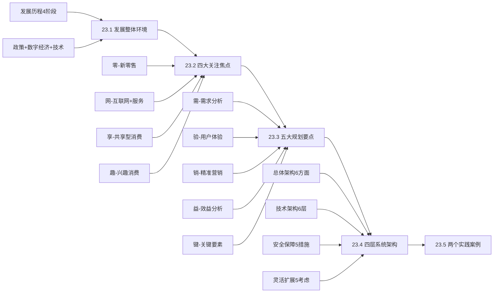

# 第23章 新型消费系统规划

> 📡 **本章定位**：规划篇第6章，全书「最接地气的商业章节」。从电子商务到智慧消费，从新零售到兴趣消费，本章用大量真实商业案例解释信息系统如何驱动消费变革。不考论文，但案例题极易出场景分析。

## 📊 章节速览

| 维度 | 详情 |
|------|------|
| **考纲位置** | 知识点23 |
| **覆盖科目** | 综合选择题 + 案例分析题 |
| **论文权重** | 不考论文 |
| **教材篇幅** | 约30页（含2个完整实践案例） |
| **核心难度** | ⭐⭐☆（概念多但贴近生活，容易理解） |

## 🗺️ 学习路径

## 📁 文件导航

| 文件 | 内容 | 建议用时 |
|------|------|----------|
| [00-导言](00-导言-以学促考之路.md) | 本章学什么、怎么学、考什么 | 5min |
| [01-项目全景](01-项目全景-华航数据资产平台.md) | 华航项目与新型消费的关联类比 | 5min |
| [02-发展环境与六大技术](02-发展环境与六大技术.md) | 四阶段演进+六技术+四特征四挑战五对策 | 25min |
| [03-四大关注焦点](03-四大关注焦点.md) | 零网享趣深度拆解 | 20min |
| [04-规划要点与系统架构](04-规划要点与系统架构.md) | 需验销益键+四层架构+安全保障+灵活扩展 | 25min |
| [05-真题考点剖析](05-真题考点剖析与预测.md) | 已考/必考/预测三级考点 | 10min |
| [06-案例实战范文](06-案例实战范文.md) | 2套案例模拟+教材案例提炼 | 15min |
| [07-考点速记](07-考点速记与自测.md) | 口诀+对比表+自测题 | 15min |

## 🔥 核心记忆口诀

| 口诀 | 展开 | 对应内容 |
|------|------|----------|
| **电移智深** | 电子商务→移动互联网→智慧消费→深度互动 | 发展四阶段 |
| **网数智化** | 网络化、数字化、智能化、科技化 | 四大特征 |
| **零网享趣** | 新零售、互联网+服务、共享型消费、兴趣消费 | 四大焦点 |
| **需验销益键** | 需求分析、用户体验、精准营销、效益分析、关键要素 | 五大规划要点 |
| **瞻隐景域群变具** | 前瞻性、隐性需求、场景细化、地域差异、群体归集、变革适应、入口工具 | 需求分析7注意 |
| **馈引工端视** | 反馈群体、引导策略、人体工程、终端特征、视觉优化 | 用户体验5注意 |
| **接量法据** | 联合接口、流量计量、法规遵循、数据沉淀 | 精准营销4注意 |
| **导活现营** | 获客导流、促活锁客、变现留客、精准运营 | 四大关键要素 |
| **请析安应端** | 请求处理、数据分析、安全保障、实时响应、多终端 | 架构设计5方面 |
| **密防训备监** | 数据加密、防火墙、安全培训、系统备份、监控日志 | 安全保障5措施 |
| **模云自接台** | 模块化设计、云计算、自动化运维、开放接口、统一平台 | 灵活扩展5考虑 |
| **设接服数应支** | 设备层、接口层、服务层、数据层、应用层、支撑平台层 | 技术架构6层 |

## ⚠️ 易错提醒

1. **四阶段顺序不能乱**：电子商务→移动互联网→智慧消费→深度互动，每个阶段对应不同技术基础
2. **四大特征≠四大焦点**：特征是「网数智化」，焦点是「零网享趣」，案例题常混淆考察
3. **新零售人货场顺序**：传统是「货→场→人」，新零售是「人→货→场」，人放第一位
4. **需求分析注意事项**：7条（瞻隐景域群变具），与用户体验5条（馈引工端视）不要混淆
